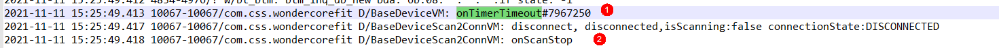

# 技术点

1. 自定义属性	

   - 如何自定义属性
     attrs.xml  --> 自定义View中解析（Typed）
     fraction：百分数

     属性定义时可以指定多种类型值

     

   - 自定义属性需要解析多个，比如color既支持"#ff0000"又支持"@color/red"呢？
        直接使用ta.getColor(id, 0),可以兼容两种方式
   
2. http请求加密

   ```
   http请求中的mNonce,mTimestamp,mMethod
   
   var nonce += Random().nextInt(99999)										//随机数
   var timestamp = System.currentTimeMillis() + Random().nextInt(9999)+1000 	//当前时间+谁技术
   var method = request.method.toLowerCase(Locale.getDefault())				//转测小写
   var MD5 = 						//post:将nonce,timestamp,clientSecret拼接后md5；get:对请求参数拆分倒序向前拼接method再md5
   		"post" -->															
   			val clientSecret = "MIGfMA0GCSqGSIb3DQEBAQUAA4GNADCBiQKBgQCVRiDk"
   			val signatureStr =
   					"nonce=${mNonce}&timestamp=${mTimestamp}\$${clientSecret}"
   			EncryptUtils.encryptMD5ToString(signatureStr)						
   		"get" -->
   			val query: List<String> = ArrayList(request.url.query!!.split("&"))		
   			//倒序后重新拼接
   			merge = "method=${sortStr}&${signatureStr}"
   			val md5 = EncryptUtils.encryptMD5ToString(merge)	
   ```

3. 方法中不能再notifyDataChanged()方法中不能再调用类notifyDataChanged()，否则会引起isComputing异常  
[log](RecycleView%20is%20computing引起bug.txt)  
原因：
```
mAdapter.notifyDataSetChanged() 
-> RecycleViewAdapter.onBindViewHolder() 
-> BondDeviceData.getDevice() -> WonderCoreCache.getData()
-> BondDeviceData.getDeviceLiveDataMerge().observe(this) {}
-> LiveDataBus.get().with<T>(k).value = it 
-> mAdapter.notifyItemChanged()
```
解决方案：
在BondDeviceData.getDeviceLiveDataMerge().observe(this)中判断是否正在isComputing,是则不调用notifyItemChanged()
```
BondDeviceData.getDeviceLiveDataMerge().observe(this) { pair ->
    if (mViewBinding.lv.isComputingLayout) return@observe
    mAdapter.notifyItemChanged()
}
```

注：notifyDataChanged的几个类似方法
```
notifyItemChanged()
notifyItemChanged()
notifyDataSetChanged()
notifyItemRangeChanged()
notifyItemInserted()
notifyItemMoved()
notifyItemRangeInserted() 521
notifyItemRemoved()
notifyItemRangeRemoved()
```
4. 单杠重复绑定失败引发不会超时的bug  
    [log](单杠重复绑定失败引发不会超时的bug.txt)
    原因分析：

  

  ```
  ==》为什么多次配对失败（已绑定或者找不到蓝牙设备）会导致单杠界面一直处于正在搜索界面，不会超时呢？
  单杠超时是state开始置为State.TimeOut，再调用disconnect()， 在蓝牙广播的onConnectionStateChanged()方法中将state置为disconnected状态，如果先前蓝牙状态已经是disconected状态，调用disconnect（）就不会触发onConnectionStateChanged（），从而导致state仍然是timeout状态，而单杠页面只要不是disconnected就会一直处于正在搜索界面。
  ==》超时时为什么超时时蓝牙会处于disconnected状态呢？
  存在两处设置超时，自己设置的TimeoutTimer和Easyble中的scanPeriodMillis，Easyble会超时会把connection的connectionState设置为disconnected，上图中的②是Easyble内部超时，①是自己的TimeoutTimer,onTimerTimeout调用的同事onScanStop也调用了，此时connection的connectionState大概率为disconnected，再调用disconnect()就不会触发onConnectionStateChanged(),导致state不能被置位disconnected
  ```

  解决方案

  ```
  disconnect是判断是否已经是disconnected，若是的话手动置位disconnected
  if (state != State.disconnected) {
          if (connection == null || connection!!.connectionState == ConnectionState.DISCONNECTED) { //判断connection的状态是否是DISCONNECTED，是的话将state设置为State.disconnected
              state = State.disconnected
              onDisconnectedX(connection?.device)
          } else {
              connection?.disconnect()
          }
  ```

  


# 注意点

后端这边上传限制文件格式，还有大小是300m


# 遗留问题

1. 查看App使用的资源，删除无效资源(20210811)
2. App内存泄漏检测、CPU、内存、耗电量、流量使用统计(20210811)
3. Activity嵌套Fragment，会出现最上面的布局与状态栏重叠问题（数据统计页面）  (20210811)

   框架问题

# 坑

1. Easyble使用全局注册，导致多个connection都会触发

   ```
   EasyBLE.getInstance().registerObserver(observer);
   
   使用跟connection相关的观察者
   ```
   
   
   
2. LiveData的Transformations.map()引起的LiveData若没被观察，那他的值不会更新

   ```
   val stateObsrv: LiveData<State> by lazy { BusMutableLiveData(State.disconnected) }
   val connectStateTxt = Transformations.map(stateObsrv) {}
   
   var state: State
   set(value) {
   	(stateObsrv as MutableLiveData).value = value //如果connectStateTxt没有被订阅，那么connectStateTxt的值不会被修改
   	BondDeviceData.getDeviceStateLiveData().value = Pair(deviceType.alias, connectStateTxt.value)//此处connectStateTxt.value永远为null
   }
   
   原因：
   Transformations.map()的LiveData只有在Active的时候才会被赋值
   ```

   

3. HTTP请求参数带有汉字

   

4. 自定义属性没有recycle()

   ```
   try {
       for (i in 0 until ta.indexCount) {
           when (val id = ta.getIndex(i)) {
               R.styleable.ElectricityView_progress -> {
                   val p = ta.getInteger(id, 0)
                   setProgress(p)
               }
               R.styleable.ElectricityView_lowPowerColor -> {
   
               }
           }
       }
   } finally {
       ta.recycle()
   }
   ```

5. //解决Android低版本，对list排序引起的错误

  ```
  val query: List<String> = request.url.query!!.split("&")
  Collections.sort(query) { str1, str2 -> // 按首字母升序排
   str2.compareTo(str1)
  }
  ```

  抛出异常消息

  ```
  Process: com.css.ble, PID: 11046
  java.lang.UnsupportedOperationException
  at java.util.AbstractList.set(AbstractList.java:681)
  at java.util.AbstractList$FullListIterator.set(AbstractList.java:143)
  at java.util.Collections.sort(Collections.java:1909)
  at com.css.base.net.interceptor.HeaderInterceptor.signatures(HeaderInterceptor.kt:69)
  ```

  原因：split返回的是不可变的list，对list进行sort操作，在低版本的Android系统会抛出UnsupportedOperationException

  解决：

  ```
  val query: List<String> = ArrayList(request.url.query!!.split("&"))
  ```

  

  

